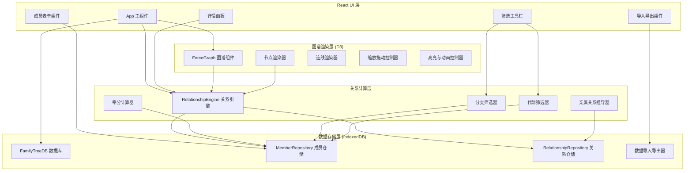
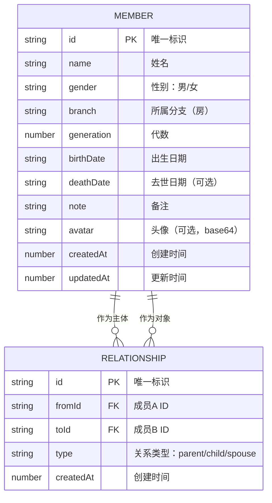

## 1. 架构设计



## 2. 技术描述

- **前端框架**：React@18 + TypeScript@5
- **构建工具**：Vite@5
- **样式方案**：TailwindCSS@3
- **图谱渲染**：D3@7（d3-force, d3-zoom, d3-selection, d3-transition）
- **本地存储**：IndexedDB + idb@7（Promise 封装库）
- **状态管理**：React Context + useReducer（本地状态，无需 Redux）
- **图标**：Lucide React

**架构分层原则**：
1. **数据层** (`src/data/`) - 纯数据操作，无业务逻辑，不依赖 UI
2. **计算层** (`src/engine/`) - 纯函数计算，输入数据输出结果，无副作用
3. **渲染层** (`src/components/graph/`) - 仅负责 D3 渲染和交互，调用计算层获取数据
4. **UI 层** (`src/components/ui/`) - React 组件，负责表单和面板，调用数据层

## 3. 目录结构

```
src/
├── types/              # 类型定义
│   └── family.ts       # 成员、关系、图谱类型
├── data/               # 数据存储层
│   ├── db.ts           # IndexedDB 初始化
│   ├── repositories/
│   │   ├── MemberRepository.ts
│   │   └── RelationshipRepository.ts
│   └── io/
│       ├── exporter.ts
│       ├── importer.ts
│       └── sampleData.ts
├── engine/             # 关系计算层
│   ├── RelationshipEngine.ts
│   ├── generation.ts   # 辈分计算
│   ├── kinship.ts      # 亲属关系推导
│   └── filters.ts      # 分支/代际筛选
├── components/
│   ├── graph/          # D3 图谱渲染层
│   │   ├── ForceGraph.tsx
│   │   ├── NodeRenderer.ts
│   │   ├── LinkRenderer.ts
│   │   └── GraphController.ts
│   ├── ui/             # React UI 层
│   │   ├── MemberForm.tsx
│   │   ├── DetailPanel.tsx
│   │   ├── FilterBar.tsx
│   │   ├── MemberList.tsx
│   │   └── DataIO.tsx
│   └── layout/
│       ├── Header.tsx
│       ├── Sidebar.tsx
│       └── AppLayout.tsx
├── context/
│   └── FamilyContext.tsx
├── hooks/
│   └── useFamilyTree.ts
├── App.tsx
├── main.tsx
└── index.css
```

## 4. 数据模型

### 4.1 ER 图



### 4.2 类型定义

```typescript
// 成员类型
interface Member {
  id: string;
  name: string;
  gender: 'male' | 'female';
  branch: string;
  generation: number;
  birthDate?: string;
  deathDate?: string;
  note?: string;
  avatar?: string;
  createdAt: number;
  updatedAt: number;
}

// 关系类型
interface Relationship {
  id: string;
  fromId: string;
  toId: string;
  type: 'parent' | 'child' | 'spouse';
  createdAt: number;
}

// 亲属关系类型
type KinshipType = 
  | 'father' | 'mother' 
  | 'son' | 'daughter'
  | 'husband' | 'wife'
  | 'brother' | 'sister'
  | 'grandfather' | 'grandmother'
  | 'grandson' | 'granddaughter'
  | 'uncle' | 'aunt'
  | 'nephew' | 'niece'
  | 'cousin_male' | 'cousin_female';

// 图谱节点
interface GraphNode extends d3.SimulationNodeDatum {
  id: string;
  member: Member;
  isExpanded: boolean;
  isHighlighted: boolean;
  isDimmed: boolean;
}

// 图谱连线
interface GraphLink extends d3.SimulationLinkDatum<GraphNode> {
  id: string;
  source: string | GraphNode;
  target: string | GraphNode;
  type: 'parent' | 'spouse' | 'sibling';
  isHighlighted: boolean;
  isDimmed: boolean;
}
```

## 5. 核心模块设计

### 5.1 关系引擎 (RelationshipEngine)

**核心方法**：
- `getParents(memberId: string): Member[]` - 获取父母
- `getChildren(memberId: string): Member[]` - 获取子女
- `getSpouse(memberId: string): Member | null` - 获取配偶
- `getSiblings(memberId: string): Member[]` - 获取兄弟姐妹
- `getKinship(memberId1: string, memberId2: string): KinshipType | null` - 计算两人关系
- `getLinealRelatives(memberId: string): Member[]` - 获取直系亲属（上下三代）
- `getCollateralRelatives(memberId: string): Member[]` - 获取旁系亲属
- `calculateGeneration(memberId: string): number` - 计算成员代数
- `filterByBranch(branch: string): Member[]` - 按分支筛选
- `filterByGeneration(generation: number): Member[]` - 按代际筛选

### 5.2 图谱控制器 (GraphController)

**核心方法**：
- `init(container: SVGElement)` - 初始化图谱
- `render(members: Member[], relationships: Relationship[])` - 渲染图谱
- `zoom(factor: number)` - 缩放
- `resetView()` - 重置视图
- `highlightNode(memberId: string)` - 高亮节点及其亲属
- `clearHighlight()` - 清除高亮
- `toggleExpand(memberId: string)` - 展开/收起分支
- `on(event: 'click' | 'dblclick' | 'hover', handler: Function)` - 事件监听

## 6. IndexedDB 存储设计

**数据库名**：`family_tree_db`

**Object Stores**：
1. `members` - 存储成员信息，主键 `id`，索引 `branch`, `generation`, `name`
2. `relationships` - 存储关系信息，主键 `id`，索引 `fromId`, `toId`, `type`

## 7. 性能优化

1. **虚拟渲染**：节点数量超过 200 时启用 Canvas 渲染
2. **力导向模拟节流**：大型图谱降低 tick 频率
3. **IndexedDB 索引**：常用查询字段建立索引
4. **计算缓存**：关系推导结果使用 Map 缓存
5. **批量更新**：数据导入时使用事务批量写入
