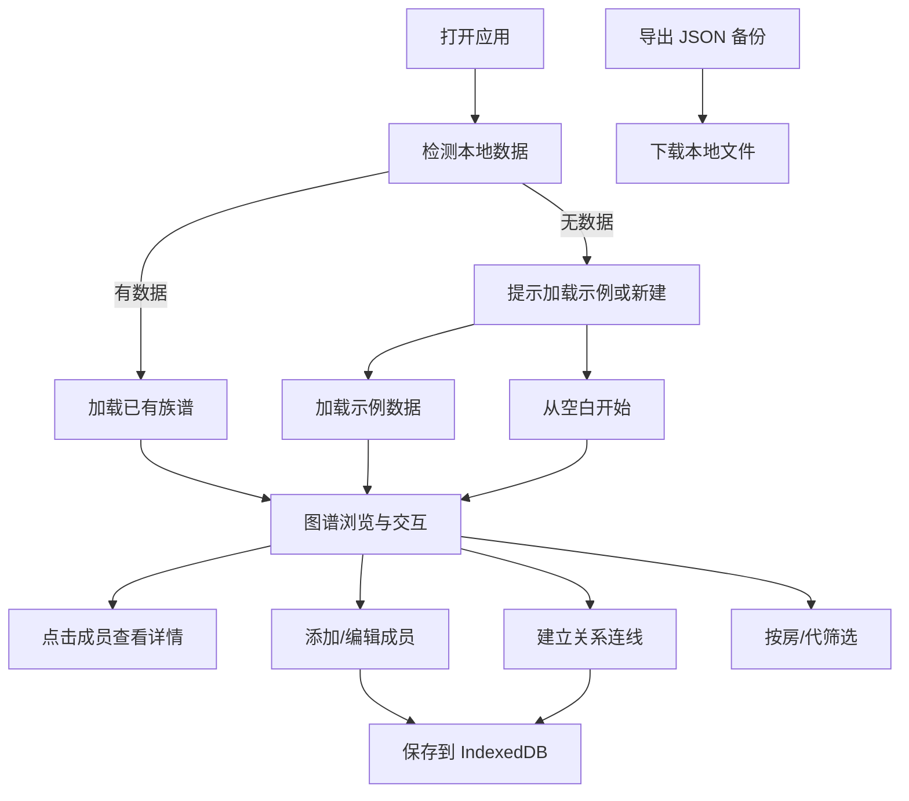

## 1. 产品概述

家族树图谱工具是一个纯本地运行的亲属关系可视化应用，帮助大家族理清成员关系、辈分和称呼。解决老人离世后年轻一代对家族关系模糊的痛点，所有数据保存在本地浏览器，不上传任何服务器。

## 2. 核心功能

### 2.1 用户角色

| 角色 | 注册方式 | 核心权限 |
|------|----------|----------|
| 本地用户 | 无需注册，直接使用 | 全部功能，数据仅存本地 |

### 2.2 功能模块

1. **图谱主页面**：D3 力导向图展示家族树，缩放拖动，节点高亮
2. **成员管理面板**：添加/编辑成员信息（姓名、生卒、所属分支）
3. **关系管理**：建立父母、配偶、子女关系连线
4. **筛选与视图**：按房/代筛选，展开收起分支
5. **数据导入导出**：JSON 格式导入导出，示例数据加载

### 2.3 页面详情

| 页面名称 | 模块名称 | 功能描述 |
|----------|----------|----------|
| 图谱主页面 | 力导向图渲染 | D3 绘制可缩放拖动的家族树，节点代表成员，连线代表关系 |
| 图谱主页面 | 节点交互 | 点击节点高亮直系和旁系亲属，双击展开/收起分支 |
| 图谱主页面 | 关系连线 | 不同颜色区分父母/配偶/子女关系 |
| 成员管理面板 | 成员表单 | 添加/编辑姓名、生卒年月、所属分支、性别 |
| 成员管理面板 | 关系建立 | 为成员选择父母、配偶、子女 |
| 筛选工具栏 | 分支筛选 | 按某一房单独查看该分支成员 |
| 筛选工具栏 | 代际筛选 | 按某一代单独查看该代成员 |
| 详情面板 | 成员详情 | 展示选中成员的完整信息和亲属关系列表 |
| 数据管理 | 导入导出 | JSON 格式导入导出族谱数据 |
| 数据管理 | 示例数据 | 一键加载示例族谱数据用于演示 |

## 3. 核心流程

用户打开应用 → 加载示例数据或空白开始 → 在图谱中浏览家族关系 → 点击成员查看详情 → 通过侧边栏添加新成员 → 建立成员间关系 → 使用筛选功能按房/代查看 → 导出数据备份

## 4. 用户界面设计

### 4.1 设计风格

- **主色调**：深墨色 `#1a1a2e` 背景，暖金色 `#e6b325` 高亮，赭石色 `#c94c4c` 强调
- **辅助色**：不同分支使用不同的柔和色系区分（蓝灰、灰绿、灰紫）
- **字体**：标题用「思源宋体」体现家族传承的厚重感，正文用「思源黑体」保证可读性
- **布局**：左侧工具栏 + 中央图谱区 + 右侧详情面板的三栏布局
- **视觉元素**：节点采用圆形头像，生卒成员用不同边框样式区分，关系连线粗细表示亲疏
- **整体风格**：典雅古朴，类似古籍家谱的现代数字化呈现

### 4.2 页面设计概述

| 页面名称 | 模块名称 | UI 元素 |
|----------|----------|---------|
| 图谱主页面 | 力导向图 | 深色背景、金色节点、彩色连线、平滑动画过渡 |
| 图谱主页面 | 缩放控制 | 右下角缩放滑块、复位按钮、全屏按钮 |
| 左侧工具栏 | 成员列表 | 可折叠的成员树状列表，按分支分组 |
| 左侧工具栏 | 添加按钮 | 悬浮添加成员按钮，金色描边 |
| 右侧详情面板 | 成员信息 | 卡片式布局，显示姓名、生卒、分支、亲属列表 |
| 顶部导航栏 | 筛选控件 | 分支下拉选择、代际滑块、搜索框 |
| 顶部导航栏 | 数据操作 | 导入、导出、加载示例按钮 |

### 4.3 响应性

- 桌面端：三栏固定布局，图谱区自适应
- 平板端：左右面板可滑动收起，图谱区占满
- 移动端：单栏布局，面板通过底部 tab 切换，触摸优化拖动和缩放

### 4.4 动画与交互

- 节点展开/收起：平滑的力导向重排动画
- 高亮效果：非相关节点淡出，相关节点呼吸灯效果
- 悬停反馈：节点放大、连线加粗、显示提示框
- 页面加载：节点逐个淡入，连线从根节点向外延伸
